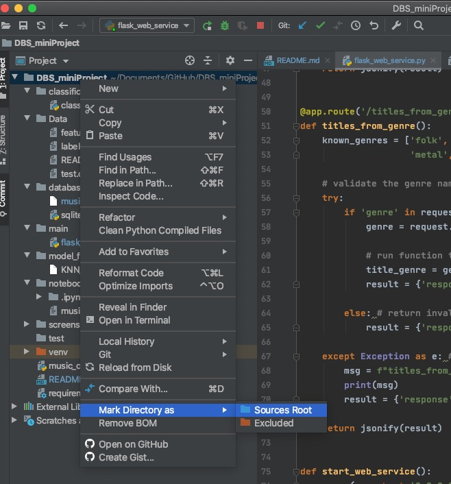
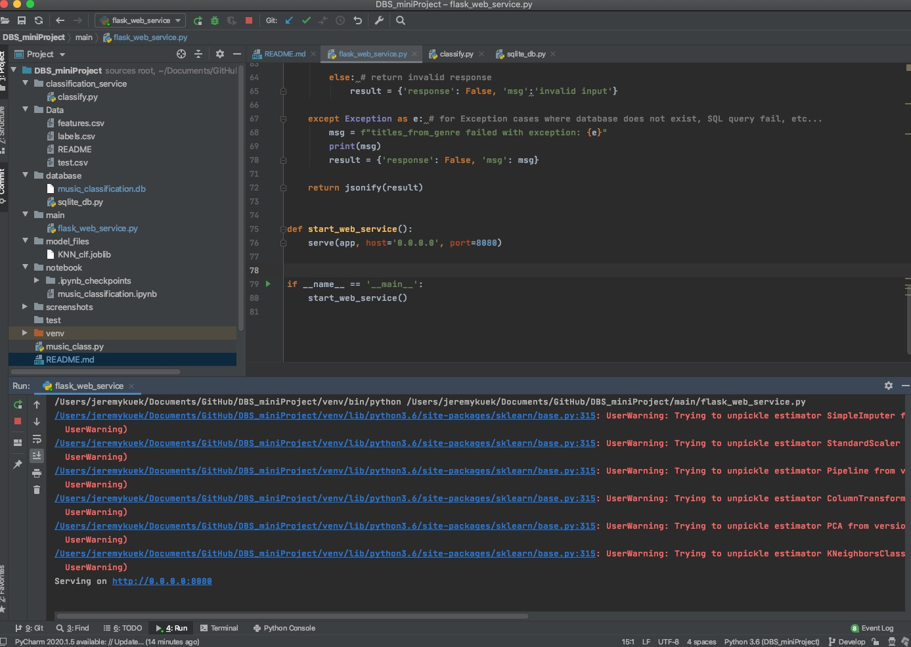
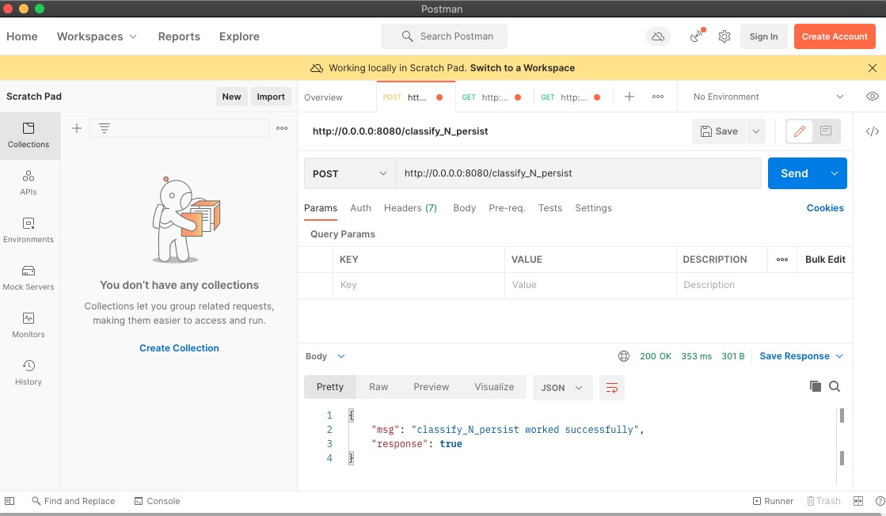
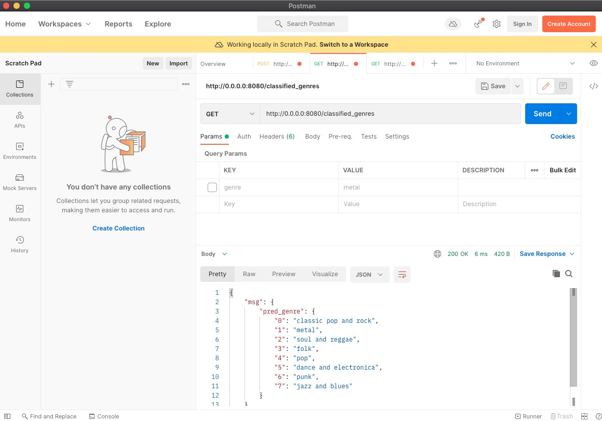
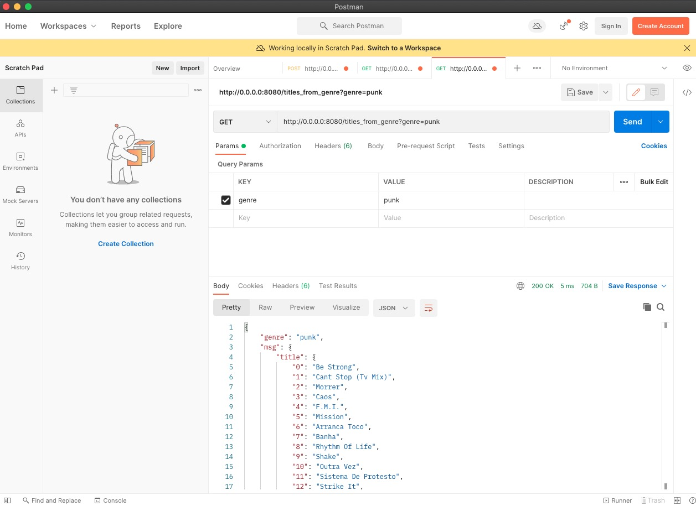
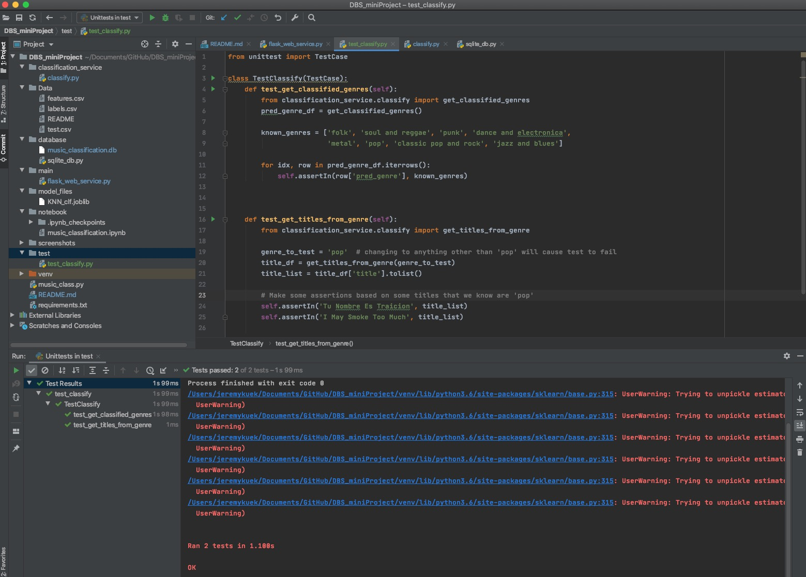

# DBS Mini Project

The project seeks to produce a music genre classification (multi-class classification) web service.
- The model development journal is documented in /notebook/music_classification.ipynb
- The web service and functional test documentation are done in this README.md file below 

After cloning the repo from GitHub, the user should mark the project root directory(screenshot below) for running the webservice and also ensure that the required libraries listed in requirements.txt is installed in your virtual environment.

## Model Definition

Details of the deriving the chosen model is documented inside /notebook/music_classification.ipynb

## Core Functions

The core functions are in /classification_service/classify.py whereas the web service simply calls these core functions. This allows for the functions to be tested (via unit tests) independent from the web service.

## Launching the Web Service

The web service is launched from /main/flask_web_service.py which fires up the Flask-Waitress web service.
Once the web service is live and running, the console should display "Serving on host:port"

## API Specification & Endpoints

We can test the REST api using the Postman app to test the respective 3 endpoints:
The response JSON with {'response':true} indicates the endpoint has been called successfully; while {'response':false} indicates some exception has occurred during the API call.

1) /classify_N_persist [POST]
- The user may opt to delete the existing database in database/music_classification.db prior to calling this endpoint to prove the endpoint does indeed cause the test dataset in /Data/test.csv to be classified and persisted to the .db file. However, there is no requirement to delete the .db file as the endpoint is designed to replace any existing data.  

	

2) /classified_genres [GET]
- Endpoint outputs all the genres found in the test dataset

	

3) /titles_from_genres [GET]
	- the endpoint should be called with a 'genre' header tag (http://0.0.0.0:8080/titles_from_genre?genre=punk) and the response can be seen below.

	

## Unit Tests

The core functions (SQL queries) in /classification_service/classify.py used in the web service are subject to unit tests to check that the database/table exists and that the response from the various functions is as-expected.

